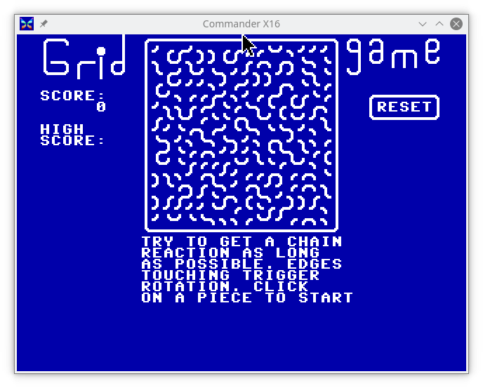

# GridGame

A 'C' implementation of a Flash game I used to play a lot of back in the days of Flash games.

Unfortunately, I don't know the original author's name, the closest I can find is a URL pointing to a now dead page: 

http://www.columbia.edu/~chc18/gridgame.swf

If *chc18* was the original author, and if anyone knows *chc18*, or whomever the original author of the SWF version was, and can get us in contact with each other, I'll gladly give further credit to them for their insipiration/original work.

I'd say this game is ~95% faithful to that original game.  Some of the limitations 
are due to my use of the so-called [PETSCII](https://en.wikipedia.org/wiki/PETSCII) character set for the graphics instead of custom graphics, which means there is no smooth animation of the pieces as they are activated.  I've also not included any sounds, but that might come in a future version.

This is orignal code that implements the gameplay, I did not port the embeded ActionScript of the original SWF game.

## Why?

Why write this game?  

Well, two basic reasons.  

First, I decided to take another run at picking up the C programming language, and like learning any new language, it helps if you have a project in mind that you want to implement.

Why write for this platform?  Being a fan of the Commodore 8-bit computers and following the development of the [Commander-X16](https://www.commanderx16.com/), I thought it would be a fun platform to target.

## Compiling the code

This was developed with the [cc65](https://cc65.github.io/) compiler, so, you'll need it installed.  I tend to work with the latest version out of git rather than one of the binary packages, so, YMMV with getting it compile if you use a potentially older version of the compiler suite.

Edit the `Makefile` and fix the paths to the various binaries at the top.

A simple `make` should give you a `GRIDGAME` that you can now load up on an X-16.

It should be a minimal effort to make a C-64 and C-128 version as well, probably coming soon.

## Notes on the kwalitee of my code

Yeah, very intentional bad spelling there.  I make no claims to my skills as a C programmer.  This is probably not "good" C code and most definitely not optimized in the suggested ways you should when writting for `cc65` compiler and the 6502 CPU.

## Potential features for future versions:

* Sound - I'll need to read up on how to make cc65 generate sounds.  It's documented, but I've not tried that yet.  Step 1 was to get the basic game working.
* High Score saving - why not?
* Board Edit Mode - Add a mode where you can click around and rotate individual pieces w/o triggering the gameplay, let you set up custom boards to see how the patterns play out.  This will also give you the ability to save/load the custom boards.
* See if it will compile with [KickC](https://gitlab.com/camelot/kickc), then all dev work could even be done on the system it is played on!
