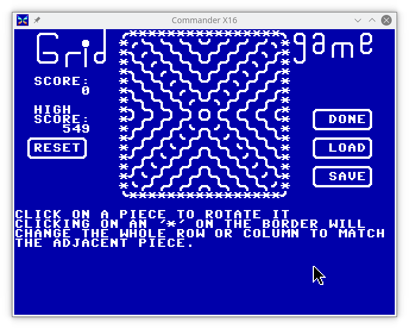

# GridGame

A game for the [Commander X-16](https://www.commanderx16.com),
Commdore 64 and 128.

A 'C' implementation of a Flash game I used to play a lot of back in the
days of Flash games.

A [short writeup](https://jayisgames.com/review/gridgame.php) about the
original SWF version of the game this is based on.

I'd say this game is ~95% faithful to that original game.
Some of the limitations are due to my use of the so-called
[PETSCII](https://en.wikipedia.org/wiki/PETSCII) character set for the
graphics instead of custom graphics, which means there is no smooth
animation of the pieces as they are activated.  I've also not included
any sounds, but that might come in a future version.

This is original code that implements the game play, I did not port the
embedded ActionScript of the original SWF game.

## Compiling the code

This was developed with the [cc65](https://cc65.github.io/) compiler,
so, you'll need it installed.  I tend to work with a semi-recent version
out of git rather than one of the binary packages, so, YMMV with getting
it compile if you use a potentially older version of the compiler suite.

Edit the `Makefile` and fix the paths to the various binaries and
destinations at the top.

A simple `make` should give you a `gridgame` that you can now load up on
a C-64, with mouse control.

To control if you get a mouse or joystick control game:

`make CONTROL=(MOUSEC|JOYC)`

To pick your target, feed `TARGET=(c64|c128|cx16)` to the above `make`
commandline.

For C-64 and C-128 targets, have the [Vice](https://vice-emu.sourceforge.io/)
Versitile Commodore Emulator installed, which will give you the `c1541` command
that is used by the `Makefile` to create a blank `.d64` disk image file as well
as copy the game and other assets into the disk image.

If you're planning on mostly using Vice, then I recommend sticking with the
joystick version.  At least for me, the mouse under Vice doesn't work very well.
Both mouse and joystick versions work fine with the [C-64](https://github.com/MiSTer-devel/C64_MiSTer)
and [C-128](https://github.com/MiSTer-devel/C128_MiSTer) cores running on a 
[MiSTer](https://mister-devel.github.io/MkDocs_MiSTer/) setup.

With a little prep-work, the `Makefile` will 'install' to your sdcard
(or a .d64 for the C-64/C-128 targets) for you (location is easily
configurable in the `Makefile`).  

For the X-16, to get this to work you will need a suitable sdcard
image file.  Either use the one provided with the emulator archive,
or make a new one.  If you're on a Linux box, check out the
[script](https://github.com/mparson/mkcard) I wrote for making new
images.  It also has instructions for setting up a `~/.mtoolsrc` file so
the `make install` will work.  You might also need to edit the `runner`
script if you've changed where on the sdcard you install the game.

For `c64` and `c128` TARGETs, there is a `newdisk` `make` rule that will
make a .d64 file for you and `make TARGET=(c64|c128) install` will copy
the game and sample [boards](boards/README.md) into the appropriate .d64
file for you.

For all TARGETs, you can `make TARGET=<target> run` after the `make install`
and it will launch the approprite emulator and start the game for you.

## Gameplay:

Mostly just like the original, click on a piece to make it rotate,
if one of its two edges touches the edges of another piece, that
piece rotates, etc.  The goal is to trigger a long chain reaction of
rotations.

## 'RESET' button

Gives you a new random board.

## 'REPLAY' button 

This lets you replay the board, resets the board to the last time the
board was 'RESET', or any 'EDIT' actions taken.  Now you can see if
you can find a better starting point from the same board.  Great for
two-players, should you find someone willing to play against. ;-)

## 'EDIT' button
Click on the 'EDIT' button and you can edit the board.  

Congratulations, you are now in the most frustrating and feature limited
PETSCII drawing program ever.

The border changes to '\*' from the line-drawing characters.  You can
now click on a piece to rotate it without triggering a chain reaction.
If you click on one of the '\*' on the boarder, it will change the
entire row or column to match the adjacent piece.

When you 'SAVE' a board, it will ***not*** check for a previous file,
it will silently overwrite it.  Similarly, attempting to 'LOAD' a
non-existent board will silently not load a board and return you to the
editor.  

**N.B.** This includes the `gridgame` binary itself.  Yeah, I need to
fix that.

The 'RESET' button on the left will reset the highscore to '0'.

Click on 'DONE' to play the board.

## 'QUIT' button
Duh, quits the game.  If you've set a new highscore, it will be saved
to disk at this point.  Do not turn off or reset the system until the 
screen has cleared and you now have a 'READY' prompt.

## Why?

Why write this game?  

Well, two basic reasons.  

First, I decided to take another run at picking up the C programming
language, and like learning any new language, it helps if you have a
project in mind that you want to implement.

Why write for this platform?  Being a fan of the Commodore
8-bit computers and following the development of the
[Commander-X16](https://www.commanderx16.com/), I thought it would be a
fun platform to target.

## Changelog:

v0.9.6
 - C-64 and C-128 versions
 - Including some sample boards made with the in game editor

v0.9.1 - Bug fix
 - 'RESET' button under the HIGH SCORE now resets the high score to '0'  

v0.9 - New features:
 - Board editing, loading, and saving.  
Bugs fixed: 
 - Clicking outside the playfield would reset score to '0'  
 - Score was incrementing *after* the screen score was updated.
 
v0.6 - High Scores are saved across runs of the game.  

v0.5 - Initial release of playable game.

## Potential features for future versions:

- Sound - I'll need to read up on how to make cc65 generate sounds.
  It's documented, but I've not tried that yet.  Step 1 was to get the
  basic game working.
- See if it will compile with [KickC](https://gitlab.com/camelot/kickc),
  then all dev work could even be done on the system it is played on!

---
I would like to extend special thanks to both the developers of cc65 as
well as the community on the cc65-devel mailing list for both providing
the compiler as well as helping me out with some learning curves along
the way.

I would also like to thank David Murry (AKA [The 8-Bit
Guy](http://www.the8bitguy.com/)) and the rest of the people behind the
Commander X-16 project, without whom I probably would not have started
back down this path of 8-bit joy.
