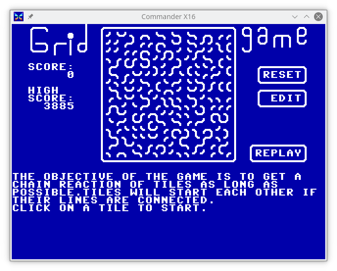

# GridGame

A game for the [Commander X-16](https://www.commanderx16.com).

A 'C' implementation of a Flash game I used to play a lot of back in the
days of Flash games.

A [short writeup](https://jayisgames.com/review/gridgame.php) about the
original SWF version of the game this is based on.

I'd say this game is ~95% faithful to that original game.
Some of the limitations are due to my use of the so-called
[PETSCII](https://en.wikipedia.org/wiki/PETSCII) character set for the
graphics instead of custom graphics, which means there is no smooth
animation of the pieces as they are activated.  I've also not included
any sounds, but that might come in a future version.

This is original code that implements the game play, I did not port the
embedded ActionScript of the original SWF game.

## Gameplay:

Mostly just like the original, click on a piece to make it rotate,
if one of its two edges touches the edges of another piece, that
piece rotates, etc.  The goal is to trigger a long chain reaction of
rotations.

## Board editing, saving, and loading

New feature in v0.9.1

The 'RESET' button on the HIGH SCORE now resets the HIGH SCORE to
'0'.

New feature in v0.9.

Click on the 'EDIT' button and you can edit the board.  

Congratulations, you are now in the most frustrating and feature limited
PETSCII drawing program ever.

The boarder changes to '\*' from the line-drawing characters.  You can
now click on a piece to rotate it without triggering a chain reaction.
If you click on one of the '\*' on the boarder, it will change the
entire row or column to match the adjacent piece.

When you 'SAVE' a board, it will *not* check for a previous file,
it will silently overwrite it.  Similarly, attempting to 'LOAD' a
non-existent board will silently not load a board and return you to the
editor.

Click on 'DONE' to play the board.

## Why?

Why write this game?  

Well, two basic reasons.  

First, I decided to take another run at picking up the C programming
language, and like learning any new language, it helps if you have a
project in mind that you want to implement.

Why write for this platform?  Being a fan of the Commodore
8-bit computers and following the development of the
[Commander-X16](https://www.commanderx16.com/), I thought it would be a
fun platform to target.

## Compiling the code

This was developed with the [cc65](https://cc65.github.io/) compiler,
so, you'll need it installed.  I tend to work with a semi-recent version
out of git rather than one of the binary packages, so, YMMV with getting
it compile if you use a potentially older version of the compiler suite.

Edit the `Makefile` and fix the paths to the various binaries and
destinations at the top.

A simple `make` should give you a `GRIDGAME` that you can now load up on
an X-16.

With a little prep-work, the `Makefile` will 'install' to your sdcard
for you (location is easily configurable in the `Makefile`).  There is
also a `run` target that will do the full build/install/run cycle.

To get this to work you will need a suitable sdcard image
file.  Either use the one provided with the emulator archive,
or make a new one.  If you're on a Linux box, check out the
[script](https://github.com/mparson/mkcard) I wrote for making new
images.  It also has instructions for setting up a `~/.mtoolsrc` file so
the `make install` will work.  You might also need to edit the `runner`
script if you've changed where on the sdcard you install the game.

## Notes on the kwalitee of my code

Yeah, very intentional bad spelling there.  I make no claims to my
skills as a C programmer.  This is probably not "good" C code and most
definitely not optimized in the suggested ways you should when writing
for `cc65` compiler and the 6502 CPU.

## Changelog:

v0.9.1 - Bug fix
 - 'RESET' button under the HIGH SCORE now resets the high score to '0'  

v0.9 - New features:
 - Board editing, loading, and saving.  
Bugs fixed: 
 - Clicking outside the playfield would reset score to '0'  
 - Score was incrementing *after* the screen score was updated.
 
v0.6 - High Scores are saved across runs of the game.  

v0.5 - Initial release of playable game.

## Potential features for future versions:

* Versions for the C-64 & C-128
* Sound - I'll need to read up on how to make cc65 generate sounds.
  It's documented, but I've not tried that yet.  Step 1 was to get the
  basic game working.
* See if it will compile with [KickC](https://gitlab.com/camelot/kickc),
  then all dev work could even be done on the system it is played on!
