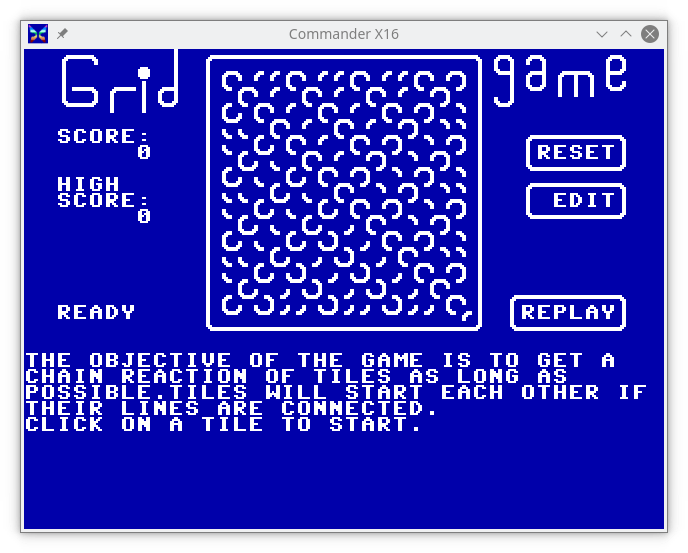
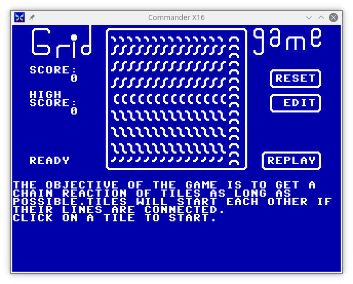
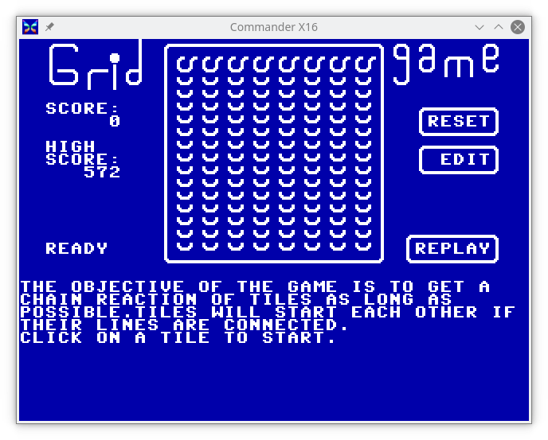

# GRIDGAME Sample Boards

These are just a few sample boards I made using the in-game editor.
Some are playable, others are just patterns that can be made with the
limited selection of PETSCII characters used in the game.

###  bigx  

---
### cpat  

---
### cross

---
### curves

---
### horseshoe

---
### uboat

